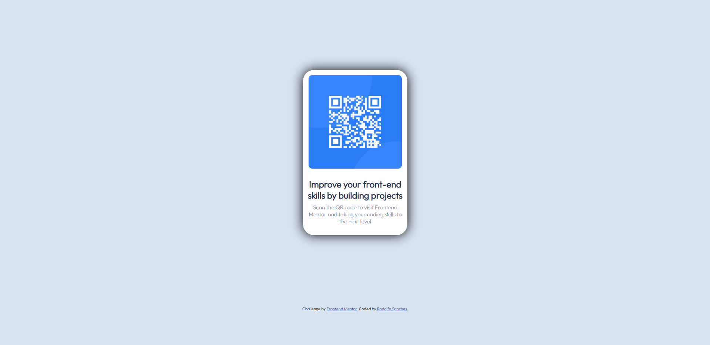

# Frontend Mentor - QR code component solution

This is a solution to the [QR code component challenge on Frontend Mentor](https://www.frontendmentor.io/challenges/qr-code-component-iux_sIO_H). Frontend Mentor challenges help you improve your coding skills by building realistic projects. 

## Table of contents

- [Overview](#overview)
  A basic website with responsive design, where we have a QR code that leads to the Frontend Mentor website.
  - [Screenshot](#screenshot)
  https://prnt.sc/Eg1JLb911Y0l
- [My process](#my-process)
  - [Built with](#built-with)
  - [What I learned](#what-i-learned)
- [Author](#author)
  Rodolfo Sanches Cima
- [Acknowledgments](#acknowledgments)
  Me :)

## Overview

### Screenshot

### Links

- Solution URL: [Add solution URL here](https://your-solution-url.com)
- Live Site URL: [Add live site URL here](https://your-live-site-url.com)

## My process

First, I filled the website with the basic content, then I formatted and styled it using CSS.

### Built with

- Visual Studio Code
- Semantic HTML5 markup
- CSS custom properties

### What I learned

I improved the responsive design, adapting it to different screens and aspect ratios.

## Author

- Website - [Rodolfo Sanches]()
- Frontend Mentor - [@sCima](https://www.frontendmentor.io/profile/sCima)
- Twitter - [@rdfsan](https://www.twitter.com/rdfsan)

## Acknowledgments

Me :)

